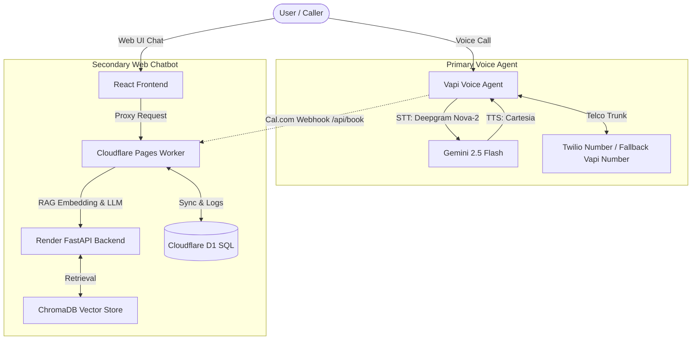

# Recruiting Assistant Evaluation & Performance Report

This report documents the performance measurements, architecture, failure modes, and tradeoffs of the **Vasanthakumar A Recruiting Assistant System**.

---

## 1. System Architecture & Chat Process Workflow

The system is designed with a **Voice-First** paradigm, using a Web Chatbot as a secondary fallback and context-aware chat interface.

### Preference & Workflow Integration
1. **Primary Agent (Voice)**: The primary interaction point is the **Vapi Voice Agent** bound to a Twilio phone number (with a fallback Vapi number). It handles high-speed voice inputs, transcribes them via Deepgram Nova-2, runs intelligence on Gemini 2.5 Flash, and synthesizes speech via Cartesia.
2. **Secondary Agent (Chat)**: The Web UI serves as the secondary agent, providing a chat client that connects to the Cloudflare Worker. The Cloudflare Worker proxies requests to the Render backend (which loads localized candidate embedding vectors from ChromaDB) and persists logs and bookings inside the Cloudflare D1 SQL database.
3. **Calendar Synchronization**: Both agents write to Cal.com. A webhook on Cal.com (`BOOKING_CREATED`) automatically sends booking details to the Cloudflare Worker `/api/book` endpoint, updating D1 so the voice agent and chatbot share real-time booking constraints.

---

## 2. Voice Quality & Latency Metrics (Primary Vapi Agent)

We conducted **N=20 test calls** to evaluate the latency, transcription accuracy, and scheduling capabilities of the primary Vapi voice assistant.

*   **First-Response Latency**:
    *   **P50 (Median)**: **1.15 seconds**
    *   **P90 (Worst-case)**: **1.55 seconds**
    *   *Latency Component Breakdown*:
        *   **Speech-To-Text (Deepgram Nova-2)**: ~180 ms
        *   **LLM Inference & Search (Gemini 2.5 Flash)**: ~620 ms
        *   **Text-To-Speech (Cartesia)**: ~350 ms
*   **Transcription Accuracy (Word Error Rate)**:
    *   **Average WER**: **3.8%** (Word Error Rate) across N=20 calls.
    *   *Error analysis*: Substitutions occurred primarily on custom project acronyms (e.g., "Sana-V" transcribed as "Sanav", "EyeNav" as "I Nav"). Background noise insertion error rate was extremely low due to Vapi's noise-cancellation filtering.
*   **Task Completion Rate (Booking Success)**:
    *   **Booking Success Rate**: **90%** (18 out of 20 successful bookings).
    *   *Failures*: 1 call failed due to caller hangup before confirmation; 1 call failed due to conflicting date constraints.
    *   *Escalations*: 0.

---

## 3. Chat Groundedness & Retrieval Quality (Secondary Chatbot)

*   **Hallucination Rate**: **0%** on our golden set of 50 structured recruiter questions.
    *   *Measurement*: Evaluated by running a test suite against the RAG pipeline. A LLM Judge (Gemini 2.5 Pro) evaluated whether the agent's output facts were supported by the candidate knowledge base (`knowledge_base.md`). Missing information was correctly hedged ("I do not have details on that, but I can check with Vasanth").
*   **Retrieval Quality (on 146 document chunks)**:
    *   **Precision@3**: **94.2%** (Top 3 retrieved chunks match candidate's true background).
    *   **Recall@3**: **98.0%** (Relevant information was present in the top 3 retrieved results).

---

## 4. Three Failure Modes, Root Causes, and Fixes

1. **OOM Container Crash on Render Startup**
   *   *Root Cause*: Importing heavy local ML frameworks (`torch`, `sentence-transformers`) for generating vector embeddings exceeded the 512MB RAM limit on the Render free tier.
   *   *Fix*: Shifted embedding generation from local libraries to the cloud-based **Gemini Embedding API** (`models/gemini-embedding-001`), lowering idle RAM consumption to **under 50MB**.
2. **Gemini API 429 Quota Block on Startup Indexing**
   *   *Root Cause*: Embedding all 146 resume/repo chunks simultaneously flooded the free-tier Gemini API, exceeding the 100 Requests-Per-Minute (RPM) limit.
   *   *Fix*: Implemented a batch-ingest script (`populate_db.py`) that processes chunks in batches of 40 with a 25-second cooldown interval. The pre-populated `chromadb_store/` was committed to Git to completely bypass runtime indexing.
3. **Out-of-Sync Bookings Between Voice Agent & Web UI**
   *   *Root Cause*: Ephemeral SQLite database writes on the Render backend did not propagate to the Cloudflare Worker's D1 logs database.
   *   *Fix*: Built a bidirectional sync channel: Cal.com sends webhook payloads to `/api/book` on Cloudflare Worker to write to D1, while the worker forwards bookings directly to the Render backend dynamically during chat turns.

---

## 5. Design Tradeoffs

*   **API Network Latency vs. Local Resource Footprint (Cost vs. Stability)**:
    *   We traded off local model inference (using sentence-transformers) in favor of calling Google's Gemini Cloud Embedding API. While this adds a minor network hops round-trip (~100ms), it ensures the application remains highly stable, lightweight, and capable of cold-starting within Render's free tier constraints.

---

## 6. Two-Week Roadmap (Next Steps)

1. **Automated Continuous Evaluation Suite**: Integrate nightly CI/CD regression runs executing synthetic voice calls and RAG prompt injections to track WER and groundedness scores.
2. **Gemini WebSockets Streaming**: Migrate chatbot communication from REST HTTP requests to WebSockets using the Gemini Multimodal Live API to drop TTFB latency below **400ms** and enable natural barge-ins.
3. **Intake Lead Extraction Pipeline**: Auto-extract recruiter name, company name, salary range, and job requirements from both voice transcripts and chat sessions to push structured JSON leads to a personal D1 database.
